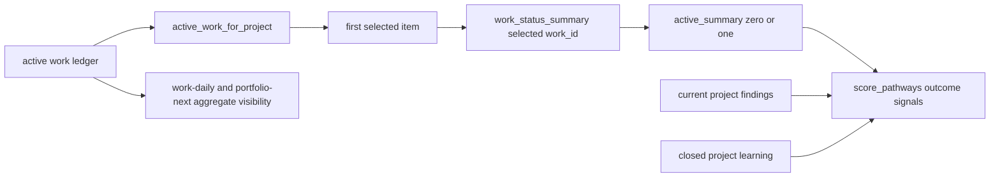

# Data Contract — Selected-Work `pathway-next` Scoring

Date: 2026-07-17
Work ID: `W-20260718-pathway-operating-layer-scope-pathway-next-scori-81ef31`
Status: verified contract; runtime implementation pending

## Boundary Decision

The outcome-state input to `score_pathways` is a singular optional record named `active_summary`. Its lineage is the selected item returned by `active_work_for_project` and the exact `work_id` passed to `work_status_summary`. It is never a collection of project work summaries.

Project findings, bounded closed-outcome learning, Pathway trust, and the global proof metric keep their broader scopes. Daily and portfolio surfaces retain their own aggregate data paths.

## Machine-Readable Artifacts

| Artifact | Purpose |
| --- | --- |
| `SELECTED_WORK_SCORING_CONTRACT.json` | Cardinality, field defaults, weights, scopes, invariants, and excluded changes |
| `SELECTED_WORK_SCORING_FIXTURES.json` | Deterministic selected, older, selected-mutation, project-finding, and no-active expectations |
| `SELECTED_WORK_SCORING_LEDGER_FIXTURE.json` | Directly writable work-item, run, measurement, control, carry-forward, and finding records for end-to-end compute/persistence tests |
| `verify-data.py` | Contract, fixture, source-weight, and live-ledger verification |

## Lineage



The contract fixes cardinality at zero-or-one before the scorer. It does not filter a collection inside the scorer and does not let the scorer select an ID.

## Field Contract

| Selected field | Default | Weight or behavior |
| --- | --- | --- |
| `pathway_coverage.seen` | empty list | selected foundation/completeness state |
| `pathway_coverage.proved` | empty list | selected profile/overlay coverage |
| proved or N/A `itinerary` rows | empty list | selected required coverage |
| `open_controls` | empty list | `+50` per selected target |
| `stale_measurements` | empty list | `+5` each |
| `missing_evidence` | empty list | `+4` each |

No active work means `active_summary = null`, `has_active_work = false`, `work_id = null`, untracked foundation nudge `8`, and a `work-start` next command.

## Deterministic Record Proof

The summary fixture makes `W-selected` newest by timestamp and supplies two older active records. Separate coverage, control, and no-active variants remove ambiguity about each boundary. The ledger fixture contains records in the same shapes and files consumed by `compute_pathway_next`, so implementation tests can write them directly into an isolated output root without inventing an adapter.

The older records carry exactly seventeen stale measurements, two missing-evidence records, an unrelated data control, and older foundation coverage. The ledger-shaped selected record deliberately has no runs or proofs, so older govern/research/quality coverage cannot satisfy it. A separate selected-control removal mutation proves the `+50` boundary in both directions.

Expected behavior:

- all older outcome-state score deltas are zero for `W-selected`;
- the selected control contributes `+50` to security and release;
- moving two stale records to selected contributes exactly `+10` to quality;
- moving two missing-evidence records to selected contributes exactly `+8` to quality;
- the critical project security finding remains `+40` regardless of selected work;
- changing only older records leaves normalized selected output unchanged;
- aggregate work and portfolio surfaces still expose the older records.

## Live Record Verification

The verifier also checks the current Koho lineage:

| Work ID | Role | Stale |
| --- | --- | ---: |
| `W-20260717-koho-complete-consultops-inte-2a7d82` | selected | `0` |
| `W-20260702-koho-seed-the-sdr-rail-prune--6e4c48` | older active | `9` |
| `W-20260630-koho-fork-josh-s-template-rev-8b69d2` | older active | `8` |

The selected Koho record owns the open Supabase PAT control targeted to security and release. The older records own no open controls. This proves the real data boundary without changing a ledger row.

## Privacy And Compatibility

The deterministic records contain synthetic IDs and no credentials, client content, commands, or absolute user-data paths. Live verification reads only ownership, timestamps, evidence presence, control targets, and the credential-control label already present in the central private ledger; it writes nothing.

No schema, migration, ledger rewrite, control promotion, cross-client copy, deployment, or production mutation is part of this data contract.

## Verification

```text
python3 /Users/alexhale/Projects/pathway-operating-layer/.planning/2026-07-17-selected-work-pathway-next-scoring/data/verify-data.py
```

Implementation must later add the post-fix conformance verifier named in the ADR and run the complete standard-library suite.

## Summary

The selected-work scoring boundary is now a machine-readable zero-or-one record contract with deterministic and live lineage proof.

## What Changed

- Fixed the scorer input cardinality at zero-or-one `active_summary`.
- Defined defaults and exact score deltas for every outcome-state field.
- Added deterministic selected, older, mutation, project-finding, and no-active records.
- Added a directly writable ledger fixture for end-to-end compute, persistence, and portfolio verification.
- Verified the current Koho `0 + 9 + 8 = 17` lineage without mutation.

## More Relevant

- Singular input cardinality and exact work-ID lineage.
- Stale, missing-evidence, control, foundation, and project-finding isolation.
- Deterministic fixtures that cannot accidentally reselect older work.

## Less Relevant

- Database migrations or a new persistence schema.
- Explicit `--work-id`, control-scope fields, and portfolio reprioritization.
- Any credential value or client data content.

## Next Pathway Must Use

- Implementation must implement the singular `active_summary` scorer contract and the deterministic conformance verifier without changing selection, project findings, or portfolio aggregation.

## Do Not Do Yet

- Do not deploy, release, mutate production, close work, or rewrite any ledger record.
- Do not change selection policy, scoring weights, control schema, or portfolio prioritization.

## Open Decisions

- None. The parameter name, null behavior, fixture records, weights, and preserved scopes are fixed.

## Active Risk Overlays

- privacy-evidence
- rollback
- incident-response
- human-gate
