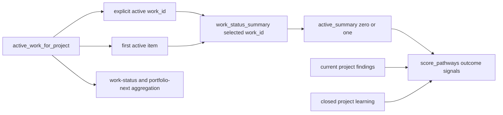

# Implementation — Selected-Work `pathway-next` Scoring

Date: 2026-07-17
Work ID: `W-20260718-pathway-operating-layer-scope-pathway-next-scori-81ef31`
Status: delivered and verified locally; not deployed or released

## Delivered Slice

`compute_pathway_next` now selects at most one `active_summary` and passes that singular optional record to `score_pathways`. When `--work-id` is supplied, the matching active outcome is pinned even when it is older than another active item or belongs to a nested checkout under the requested project root. The scorer derives coverage, controls, stale measurements, and missing evidence only from that selected summary.

The broader inputs intentionally remain unchanged:

- current project findings still cross active-outcome boundaries;
- bounded learning from closed project outcomes still dampens scores;
- the most-recently-updated selector remains the default when no work ID is supplied;
- recommendation persistence still records the selected work ID;
- `work-status` and `portfolio-next` still aggregate and expose older active work.

Unknown, closed, and different-project work IDs now fail closed without a report or recommendation-ledger row. No schema, control model, scoring weight, portfolio algorithm, deployment, or production data changed.

## Runtime Boundary



The scorer no longer accepts a list-shaped outcome input. That makes aggregation across active outcomes unavailable at the function boundary instead of relying on a filter inside the scorer.

## Test-First Verification

The regression was written before the runtime fix. Against the old scorer, it failed on seven independent contamination claims:

1. list-shaped scorer input;
2. older foundation coverage;
3. seventeen older stale measurements plus two missing-evidence rows;
4. an older data control;
5. selected stale mutation delta;
6. selected missing-evidence mutation delta;
7. metamorphic invariance when only older work changes.

After the boundary change and quality hardening, the deterministic conformance verifier executes 32 assertions covering:

- selected and no-active cardinality;
- older versus selected stale and missing-evidence score deltas;
- older versus selected control ownership, exact reasons, and target weights;
- older govern/research coverage and selected itinerary openness;
- older proved and N/A coverage versus selected profile requirements;
- selected proved coverage suppression;
- current project security findings;
- exact closed-outcome learning damping;
- normalized-output invariance under older-work mutation;
- selected tier, risk-overlay, and carry-forward lineage against contradictory older metadata;
- exactly one persisted recommendation with selected work and recommendation identity;
- explicit selection of a non-newest active outcome, including nested-checkout containment, goal, contract, stale rows, and carry-forward;
- fail-closed unknown, closed, and different-project selection;
- older controls, missing evidence, and stale measurements in `work-status`;
- aggregate active work, controls, and staleness in `portfolio-next`.

## Verification Receipts

| Check | Result |
| --- | --- |
| Red phase against the prior scorer | `7` expected failures |
| Focused runtime conformance | `PASS`, exactly `32` assertions |
| Aggregate-scoring mutation gate | `PASS`, all `7` original contamination paths killed |
| Data-contract verifier after implementation | `PASS` |
| Complete standard-library suite | `593/593 checks passed` |
| Whitespace/error scan | `git diff --check` passed |
| Audit preflight | Pure stdlib CLI; no package or web audit tooling applies, no files installed |

Commands:

```text
python3 .planning/2026-07-17-selected-work-pathway-next-scoring/implementation/verify-selected-work-scoring.py
python3 .planning/2026-07-17-selected-work-pathway-next-scoring/quality/verify-selected-work-quality.py
python3 .planning/2026-07-17-selected-work-pathway-next-scoring/data/verify-data.py
python3 scripts/tests/operating_layer_test.py
git diff --check
```

## Independent Review

Three isolated review perspectives inspected the runtime change, fixture, test, and verifier.

| Perspective | Initial finding | Resolution | Final |
| --- | --- | --- | --- |
| Skeptic | Learning preservation was only structural; verifier path was machine-specific | Added exact `-3` learning behavior and portable resolved root | `PASS` |
| Code quality + plan conformance | Control reason and selected itinerary were not asserted | Added both assertions; all eleven ADR cases confirmed | `PASS` |
| Test coverage | Four possible false-pass paths | Added proved/N/A isolation, aggregate visibility, exactly-one persistence, and assertion-count enforcement | `PASS` |
| Architecture/test quality | Carry-forward, tier, and overlay fixtures were not adversarial | Added contradictory older metadata and a faithful aggregate-scoring mutant | `PASS` |
| Security | Focused verification inherited a predictable shared deletion root | Allocated a process-owned UUID test root with a guarded cleanup boundary | `PASS` |

The remaining advisory observation is that the comprehensive regression is long. It stays as one registered end-to-end test because its mutations share one fixture and one normalized projection; extracting production abstractions for test organization would add code without changing behavior.

## Compatibility And Rollback

Rollback is one local boundary reversal: change the scorer parameter back to a summary collection and restore the aggregation loop and caller. No stored record needs migration or repair. The new regression and conformance verifier would then fail on the known seven contamination paths, making an accidental rollback visible.

The local release candidate preserves the previously reviewed pending source and test edits. Merge, push, deployment, external send, production flag changes, and work close remain outside this implementation receipt.

## Summary

The delivered runtime now scores one selected active outcome while preserving project findings, closed-outcome learning, persistence identity, and aggregate portfolio visibility.

## What Changed

- Replaced list-shaped `work_summaries` scoring input with singular optional `active_summary`.
- Honored `pathway-next --work-id` as an explicit, active, project-bound selection.
- Deleted the cross-outcome aggregation loop from the scorer.
- Added a deterministic 32-assertion runtime conformance test and standalone verifier.
- Registered a faithful aggregate-scoring mutant that the corpus kills on all seven original contamination paths.
- Proved exact selected-work deltas, persistence identity, and aggregate-report compatibility.

## More Relevant

- Runtime regression quality and mutation resistance.
- Selected-work versus project-wide signal ownership.
- Stable persistence and portfolio behavior.

## Less Relevant

- Database migrations or control-scope schema.
- Scoring-weight redesign.
- Production deployment or ledger cleanup.

## Next Pathway Must Use

- Quality must verify the selected-work scoring regression corpus, mutation resistance, and full-suite integration before security or release work.

## Do Not Do Yet

- Do not deploy, release, mutate production, close the work item, or rewrite historical ledger records.
- Do not change score weights, project-finding scope, learning scope, or portfolio aggregation.

## Open Decisions

- None for this implementation slice. Release timing remains outside the current authorization.

## Active Risk Overlays

- privacy-evidence
- rollback
- incident-response
- human-gate
