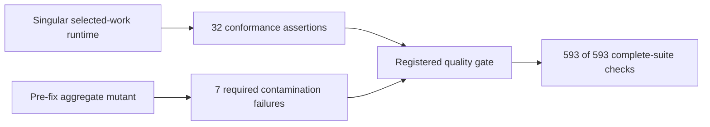

# Quality — Selected-Work `pathway-next` Scoring

Date: 2026-07-17
Work ID: `W-20260718-pathway-operating-layer-scope-pathway-next-scori-81ef31`
Status: quality gate passed locally; not merged, released, or deployed

## Gate Decision

The selected-work scoring boundary is protected by a falsifiable regression gate. The normal implementation passes a 32-assertion conformance corpus, while a faithful restoration of the old five-seam aggregate scorer fails on all seven original contamination paths. The registered full suite passes exactly `593/593` checks.

The quality step adds no further scoring-weight, ledger-schema, portfolio, production-flag, or live-data change.

## Verification Shape



The mutant restores the original behavior at five exact seams:

1. list-shaped `work_summaries` scorer input;
2. aggregation of coverage, controls, staleness, and missing evidence;
3. aggregate `has_active_work` state;
4. construction of every active work summary in `compute_pathway_next`;
5. passing the aggregate list into the scorer.

The mutation test refuses a partial rewrite, executes the complete conformance corpus, and requires the seven named failures that reproduced the original defect. A crash or a vacuous no-op mutation cannot satisfy the gate.

## Adversarial Corpus

The deterministic fixture now makes older work deliberately hostile to the selected outcome:

| Boundary | Selected work | Older work | Proof |
| --- | --- | --- | --- |
| Stale measurements | `0` | `17` | older rows add zero; two moved rows add exactly `+10` |
| Missing evidence | `0` | `2` | older rows add zero; two moved rows add exactly `+8` |
| Controls | security + release | data | only the selected control adds exact `+50` targets and reasons |
| Foundations | open govern/research | proved govern/research/quality | older coverage cannot satisfy selected foundations |
| Tier | production-secure | live / demoable | selected tier remains authoritative |
| Risk overlay | selected human gate | rollback / incident response | only the selected overlay appears in the result |
| Carry-forward | selected implementation baton | chronologically newer contradictory security baton | selected baton remains authoritative |
| Portfolio visibility | selected result only | all older state retained | `work-status` and `portfolio-next` remain aggregate surfaces |

## Verification Receipts

| Check | Result |
| --- | --- |
| Python compilation | `PASS` |
| Focused selected-work conformance | `PASS`, exactly `32` assertions |
| Aggregate-scoring mutation resistance | `PASS`, all `7` original contamination paths killed |
| Complete standard-library suite | `593/593 checks passed` |
| Fixture duplicate-key validation | `PASS` |
| Whitespace/error scan | `git diff --check` passed |
| Runtime/deployment mutation | none |

Canonical verifier:

```text
python3 /Users/alexhale/Projects/pathway-operating-layer/.planning/2026-07-17-selected-work-pathway-next-scoring/quality/verify-selected-work-quality.py
```

The verifier reruns focused conformance, executes the registered aggregate mutant test, and then requires the pinned `593/593` complete-suite receipt.

## Independent Review

Three isolated critics reviewed the implementation and then re-reviewed the hardened gate.

| Perspective | Finding | Resolution | Final |
| --- | --- | --- | --- |
| Product skeptic + plan conformance | durable receipt still showed `22/580` | refreshed the receipt, added explicit-work cases, and documented mutation resistance | `PASS` |
| Architecture + test coverage | carry-forward, tier, and overlays were non-adversarial; suite count accepted any `N/N` | added contradictory metadata and pinned exactly `593` checks | `PASS` |
| Security | predictable shared temp cleanup, followed by an unsafe environment-controlled delete target | removed caller-controlled roots; the harness now creates and guards a process-owned UUID path under `/private/tmp` | `PASS` |

The prescribed opposite-model CLI was unavailable on this machine (`claude: command not found`). No merge or release occurred. The closest available substitute was the isolated three-perspective review above; an opposite-model review remains a pre-merge gate rather than a false completion claim.

## Compatibility And Rollback

The quality additions are test-only: one stronger fixture, two added conformance assertions, one registered mutation test, and standalone verifier/receipt artifacts. Removing the quality test and verifier returns the prior test surface; no persisted ledger record or runtime data needs migration.

The runtime rollback described in the accepted ADR remains intentionally detectable: restoring aggregate scoring causes the mutation-backed regression corpus to fail.

## Summary

Selected-work `pathway-next` scoring now has a falsifiable regression gate that distinguishes selected metadata and outcome signals from contradictory older work, kills the original aggregate-scoring defect, and passes the pinned full suite.

## What Changed

- Expanded conformance from 22 to 32 assertions for selected tier, risk-overlay, carry-forward lineage, explicit selection, and fail-closed invalid IDs.
- Made older fixture metadata deliberately contradictory and chronologically competitive.
- Registered a faithful aggregate-scoring mutant and required all seven original contamination failures.
- Replaced shared or caller-controlled deletion roots with a process-owned guarded test directory.
- Pinned the quality receipt to exactly `593/593` checks.

## More Relevant

- Security review of privacy/evidence exposure and work/project lineage.
- Classification of synthetic fixture findings versus current live project findings.
- Preserving the singular selected-work boundary through future scorer changes.
- Opposite-model review before any merge.

## Less Relevant

- Refactoring the long end-to-end conformance test solely for aesthetics.
- Score-weight, schema, or portfolio redesign.
- Deployment, production mutation, or historical ledger cleanup.

## Next Pathway Must Use

- Security must verify privacy/evidence hygiene, synthetic-versus-live finding scope, and the absence of new work/project lineage exposure before field or release work.

## Do Not Do Yet

- Do not merge, release, deploy, mutate production, close the work item, or rewrite historical ledger records.
- Do not change scoring weights, control schema, project-finding scope, or portfolio aggregation.

## Open Decisions

- No quality-design decision remains. Merge timing and the required opposite-model pre-merge review remain outside this step's authorization.

## Active Risk Overlays

- privacy-evidence
- rollback
- incident-response
- human-gate
