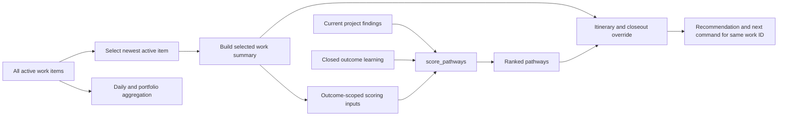

# Research Dossier — Selected-Work Scoring for `pathway-next`

Date: 2026-07-17
Work ID: `W-20260718-pathway-operating-layer-scope-pathway-next-scori-81ef31`
Pathway: `research`

## Question

What must be known for certain before changing `pathway-next` so its recommendation is scored from the selected active work ID without hiding current project-wide findings or removing portfolio visibility?

## Executive Answer

The defect has one direct seam. `compute_pathway_next` selects one active work item, uses that item for the returned work ID, goal, outcome contract, carry-forward, itinerary, and closeout state, but passes summaries for every active work item into `score_pathways`. The scorer then unions coverage and controls and sums stale or missing measurements across those summaries. No other code calls `score_pathways` directly.

The smallest safe implementation is to make the scorer accept one optional `active_summary`, derive all outcome state from that singular summary, and leave project findings, closed-outcome learning, Pathway trust, global autonomy metrics, daily work, and portfolio prioritization at their existing scopes.

The live Koho evidence proves the impact. The selected ConsultOps/Ko R2 outcome has zero stale measurements and one current Supabase credential control. Two older active Koho outcomes have nine and eight stale measurements. The current report assigns the combined seventeen to quality, scoring it at `76`, above the selected outcome's real security and release control at `50` each. This is recommendation contamination, not a stale state inside the selected outcome.

## Sources And Method

Only primary local sources were needed:

| Source | Why authoritative |
| --- | --- |
| `scripts/operating-layer.py:3466-3524` | Work summaries filter runs, measurements, and controls by exact work ID |
| `scripts/operating-layer.py:4682-4689` | Active-work selection is most-recently-updated first |
| `scripts/operating-layer.py:4716-4833` | Complete scoring inputs and weights |
| `scripts/operating-layer.py:5306-5436` | Selected-work orchestration and the all-summary scoring call |
| `scripts/operating-layer.py:6475-6573` | Portfolio aggregation is an independent path |
| `scripts/tests/operating_layer_test.py:551-619` | Existing `pathway-next` integration fixture and best insertion point |
| `/Users/alexhale/Projects/memory-vault/operator-intelligence/work-items.ndjson` | Live active-work identity and ordering |
| `/Users/alexhale/Projects/memory-vault/operator-intelligence/pathway-measurements.ndjson` | Live measurement ownership and staleness |
| `/Users/alexhale/Projects/memory-vault/operator-intelligence/controls.ndjson` | Live control ownership and target pathways |
| `/Users/alexhale/Projects/memory-vault/operator-artifacts/2026-07-18-pathway-next-koho.md` | Rendered recommendation showing the false `17` versus the real current control |

Method: trace every scorer input to its source, enumerate every direct call site, inspect the live work/control/measurement ledgers, reproduce the Koho counts through `work-status`, and stress the proposed boundary with architecture, product, and security critics.

## Current Failure Evidence

### Live Koho state

| Work ID | Selection role | Stale | Missing evidence | Open controls |
| --- | --- | ---: | ---: | ---: |
| `W-20260717-koho-complete-consultops-inte-2a7d82` | Selected | `0` | `0` | `1` |
| `W-20260702-koho-seed-the-sdr-rail-prune--6e4c48` | Older active | `9` | `0` | `0` |
| `W-20260630-koho-fork-josh-s-template-rev-8b69d2` | Older active | `8` | `0` | `0` |

The selected control is `C-security-exposed-supabase-pat-remains-active-unti-230d57`, targeted to security and release. The Koho report states:

- quality: score `76`, reason `17 stale measurement(s) need re-verification`;
- security: score `50`, reason is the selected Supabase credential control;
- release: score `50`, same selected control.

This directly falsifies the intended identity contract: the command and returned work ID refer to the current ConsultOps/Ko R2 outcome, while the winning score is supplied by two older outcomes.

### Target-project control audit

The Pathway operating-layer project currently has one active work item, no non-selected active item, and zero open controls across its eleven recorded work items. There is therefore no live project-wide control to promote before implementing this change.

A global active-work audit found three current open controls: Koho website SEO assurance, Koho's exposed Supabase PAT, and the agents/Marin activation approval. Every control belongs to the most-recently-updated selected work item for its project. No current open control would be dropped by selected-summary scoring, and no promotion is required before implementation.

The target project's unresolved cross-outcome concerns are already project-local findings in `.planning/review/latest-findings.json`; `project_local_findings` keeps them in the project-scoped scoring input. This includes the separately deferred explicit-selection concern.

## Scoring Boundary Map

| Input or derived signal | Correct scope | Current source | Required behavior |
| --- | --- | --- | --- |
| selected work item and `work_id` | Selected outcome | `compute_pathway_next` lines 5333-5337 | Preserve |
| seen/proved pathway coverage | Selected outcome | summary aggregation lines 4752-4758 | Read one summary only |
| open controls | Selected outcome | summary aggregation line 4759 | Read one summary only |
| stale measurements | Selected outcome | summary aggregation line 4760 | Read one summary only |
| missing evidence | Selected outcome | summary aggregation line 4761 | Read one summary only |
| outcome profile and risk overlays | Selected outcome, informed by current project findings | lines 5339-5350 | Preserve |
| latest carry-forward | Selected outcome | line 5338 and lines 4775-4778 | Preserve |
| itinerary and closeout readiness | Selected outcome | lines 5363-5390 | Preserve |
| operating-layer and project-local findings | Project | lines 5329-5331 and 4799-4803 | Preserve cross-outcome |
| closed-outcome learning | Project history | lines 4716-4727 and 4816-4830 | Preserve bounded dampening |
| Pathway trust | System | lines 5392 and 5402 | Preserve for confidence, not ranking |
| recommendation/proof metric | System | lines 5409-5412 | Preserve for autonomy, not ranking |
| daily dashboard and portfolio queue | Portfolio | lines 3548-3575 and 6475-6573 | Preserve all-work aggregation |

The unused `context = current_work_context(...)` assignment at line 5328 does not influence ranking and is unrelated to this correction.

## Call And Data Flow

The implementation should remove the `A -> F` path that currently passes every summary. It must retain `A -> K`.

## Smallest Safe Implementation Seam

1. Keep `active_work_for_project` unchanged for this outcome.
2. In `compute_pathway_next`, select the first active item as today and build only its `work_status_summary`.
3. Change `score_pathways(..., work_summaries, ...)` to a singular `score_pathways(..., active_summary=None, ...)` contract.
4. Replace the aggregation loop with direct reads from `active_summary or {}`.
5. Set `has_active_work = bool(active_summary)`.
6. Do not change project findings, closed learning, confidence, autonomy, persistence, daily work, or portfolio code.

A singular parameter is preferable to passing `[active_summary]`: it makes the outcome boundary explicit and prevents accidental aggregation from returning through a future caller.

## Regression Design

Add `test_pathway_next_scores_only_selected_active_work` immediately after `test_pathway_next_recommendation_and_cohesion`, then register it beside that test in `main()`.

Use isolated fixture roots and distinct timestamps. Do not add records to the older outcome through `work-log`, because that updates its `updated_at` and makes it the selected outcome. Do not compare two persisted `next_command` strings literally, because recommendation IDs intentionally increment.

The regression must prove:

1. `older-stale-ignored`: selected stale count is zero; older active outcomes total seventeen; quality has no stale reason or bump.
2. `selected-stale-counted`: moving two stale measurements to the selected work produces exactly the two-measurement quality reason and `+10` bump.
3. `older-missing-ignored`: a measurement without `evidence_id` on older work adds no selected quality reason or score.
4. `selected-missing-counted`: moving two missing-evidence measurements to selected work produces exactly the two-measurement reason and `+8` bump.
5. `control-boundary`: an older control has no effect; the same control on selected work adds the exact target reason and `+50` weight.
6. `coverage-boundary`: older govern/research runs or proofs do not satisfy selected foundation or itinerary state.
7. `project-finding-preserved`: a current project security finding retains its score and reason. Assert the score/reason, because itinerary coverage may override the final recommendation.
8. `metamorphic-isolation`: changing only the non-selected outcome leaves normalized ranked scores/reasons, selected recommendation, confidence, work ID, itinerary, closeout state, and autonomy tier unchanged.
9. `identity-coherence`: persist once and prove the recommendation row and generated command name the selected work ID.
10. `portfolio-visibility`: `work-status` and `portfolio-next` still expose the older outcome's stale measurements and controls.
11. `full-suite`: `python3 scripts/tests/operating_layer_test.py` exits zero.

The existing current-control integration assertions at `scripts/tests/operating_layer_test.py:593-612` must remain green.

## Security And Control Findings

### Blockers

None. The target project has no non-selected active work and no controls to promote. The live Koho non-selected outcomes responsible for the seventeen stale measurements have no open controls. The current Supabase credential control belongs to the selected Koho outcome, so selected-summary scoring preserves it. All three current open controls across the central ledger belong to their projects' selected active outcomes.

### Warnings

- A future work-local control that is genuinely project-wide must be promoted to a project finding whose evidence path is recognized by `_finding_in_project`; a project label alone is not sufficient.
- Resolved records in `.planning/review/latest-findings.json` are still ingested because local finding ingestion does not filter `status`. That conservative false-positive scoring predates this defect and is separate work.
- The most-recently-updated selector can change after housekeeping. Explicit `--work-id` selection remains a separate interface decision already recorded in governance.
- A research critic accidentally ran one extra advisory `pathway-next`; it did not edit the repository but may have appended one central recommendation row. This does not affect the boundary findings or test design.

### Information

- `score_pathways` has one direct caller.
- `work_status_summary` already enforces exact work-ID ownership correctly.
- Portfolio scoring has its own aggregation implementation and does not call `score_pathways`.
- The full repository suite passed `558/558` immediately before this research step; it must run again after the eventual code change.

## Planning-Ready Decisions

- Implement the singular selected-summary scorer contract.
- Preserve the existing most-recently-updated selector in this slice.
- Preserve project findings and bounded closed-outcome learning.
- Preserve aggregate visibility in daily and portfolio surfaces.
- Use the Koho zero-versus-seventeen case as the release-defining regression.
- Treat explicit `--work-id`, local resolved-finding filtering, and project-scoped control schema as separate follow-ups.

## Summary

Research confirms a one-call-site leakage defect and a surgical correction. One selected work summary must supply all outcome state; current project findings, historical learning, trust/autonomy, and portfolio reporting keep their broader scopes.

## What Changed

- Mapped every scoring and downstream input to selected-outcome, project, system, or portfolio scope.
- Reproduced the live Koho `0 + 9 + 8 = 17` contamination and its ranking impact.
- Audited non-selected controls and found no blocker requiring promotion.
- Converted the governed decision into a precise implementation seam and eleven-case regression plan.

## More Relevant

- A singular `active_summary` scorer contract.
- The Koho quality `76` versus selected security/release `50` evidence.
- Metamorphic isolation of non-selected work state.
- Preservation of current project findings and aggregate portfolio surfaces.

## Less Relevant

- Rewriting active-work selection policy.
- Adding a new control-scope schema.
- Refactoring portfolio prioritization or the overall scoring weights.
- Refreshing unrelated resolved local findings in the same change.

## Next Pathway Must Use

- Data must define and verify the singular selected-summary contract, exact null/no-active behavior, and deterministic fixture records before implementation changes the scorer.

## Do Not Do Yet

- Do not change `active_work_for_project`, add `--work-id` behavior, or alter portfolio scoring.
- Do not suppress project findings or the selected Supabase credential control.
- Do not implement, deploy, release, close work, or mutate production during research.

## Open Decisions

- Data must decide whether the singular scorer parameter should be named `active_summary` or `selected_work_summary`; behavior is already fixed.
- A later outcome may govern explicit selection when several work items are active.
- A later quality/tech-debt outcome may stop scoring resolved local review findings.

## Active Risk Overlays

- privacy-evidence
- rollback
- incident-response
- human-gate
