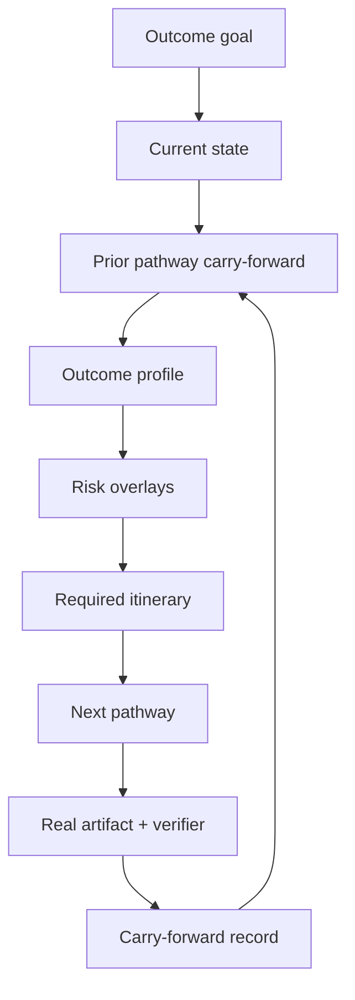

# Hypercritical Audit — Pathway Cohesion System

Date: 2026-07-05  
Scope: system-level audit of `/pathway` as a cohesive development ecosystem, with emphasis on recall, proactivity, and cross-project reliability.

## Verdict

The pathway system is strong at recording proof and weak at preserving understanding.

It can say "research is done." It cannot yet reliably say "research changed the next step in these ways, so govern must now decide X and avoid Y." That is the exact failure Alex noticed.

## Critical Findings

### 1. Pathway completion is treated as coverage, not learning

`work-log` records evidence and proof. `pathway-next` uses that proof to mark a pathway demonstrated or covered. But the system lacks a first-class carry-forward record containing the semantic result of the pathway.

Impact: a pathway can pass without the next pathway inheriting its conclusions.

Required change: every pathway proof must produce or reference a carry-forward object:

- result summary,
- what changed,
- more relevant now,
- less relevant now,
- next pathway must use,
- do not do yet,
- source artifact.

### 2. The next recommendation does not explain dependency on prior outputs

After research was logged, the engine recommended govern because `.planning/STATE.md` was missing. That was directionally right but contextually thin. It should have said:

> Research established P0 proof/closeout safety as the first implementation slice. Govern must now pin that metric and acceptance gate.

Impact: users see a correct pathway label but lose the causal chain.

Required change: `pathway-next` output must include a "How prior work changed this recommendation" section.

### 3. `.planning/STATE.md` is necessary but insufficient

The router correctly flagged missing present-state truth. A state file helps, but if it is only a static note, it becomes another stale document.

Required change: state must be derived or refreshed from work item, latest proof, latest carry-forward, open decisions, and next pathway dependency.

### 4. The current proof model can still accept weak proof

The research proof was executed and exited 0, but the engine marked `trivial_verifier: true` because the canary did not fail. The pathway still accepted it as proof.

Impact: the system can observe proof weakness and still let it count.

Required change: closeout and future pathway proof readiness must reject trivial verifier and failed canary states, at least for new proofs.

### 5. The command handoff still leaks stale proof syntax

Generated report text still shows `--verified-by "<verification-command>"` even though the parser says `--verified-by` is attestation only.

Impact: the system tells users how to record non-proving evidence.

Required change: all generated proof handoffs must use `--verify-cmd`.

### 6. The tier model underspecifies risk

The `live` tier can omit security even though Koho-class live work often includes tenants, PII, external users, RLS, client portals, or production data.

Impact: the system can call an outcome live-ready without the security pathway proving the actual risk surface.

Required change: risk overlays must force security/data production-secure behavior when risky terms appear.

### 7. The marketplace is still pathway-first, not outcome-first

The existing model ranks pathway nouns. The desired system should classify the outcome, identify risk overlays, then compose a minimal itinerary.

Impact: users need to understand the pathway catalog instead of the system intuitively shaping the route.

Required change: introduce outcome profiles before expanding pathway count.

## What The System Should Become

`/pathway` should be an operating system for one outcome:

## Always / Ask First / Never

### Always

- Read the active work item and project `.planning/STATE.md`.
- Read the latest carry-forward records before ranking the next pathway.
- Show how the prior pathway changed the current recommendation.
- Preserve one shared work ID per outcome.
- Require evidence as a real file plus executed verifier.
- Separate "sent", "send-ready", and "not sent" for human/customer gates.

### Ask First

- Production deploys.
- External sends.
- Force-pushes.
- Production flag flips.
- Table drops or destructive migrations.
- Marking high-risk pathways not applicable.

### Never

- Treat `--verified-by` as proof.
- Close a work item with empty itinerary coverage.
- Treat a trivial verifier as sufficient proof.
- Let `live` skip security when the work touches auth, PII, tenants, RLS, external users, client portals, or production data.
- Add broad new pathway categories when a risk overlay would solve the problem.

## System Smells To Remove

| Smell | Fix |
|---|---|
| "Pathway is proved" but no summary of what changed | Carry-forward record required per pathway. |
| "Next pathway: govern" with no prior-output dependency | Next report must include prior-output delta. |
| Research artifacts live in `.planning` but next command ignores their conclusions | Router reads carry-forward/state before ranking and reporting. |
| Generated proof commands still use attestation syntax | Switch to `--verify-cmd`. |
| User has to understand the marketplace to use it well | Outcome profiles compose pathways for the user. |
| Security appears as one pathway, not a forced risk overlay | Risk keywords escalate itinerary. |

## Audit Conclusion

The missing product is not a larger marketplace. It is a continuity layer.

The next spec should ship the smallest version of that continuity layer: present-state truth, carry-forward record, pathway-next consumption, and proof that research-to-govern recommendations use the research result.

