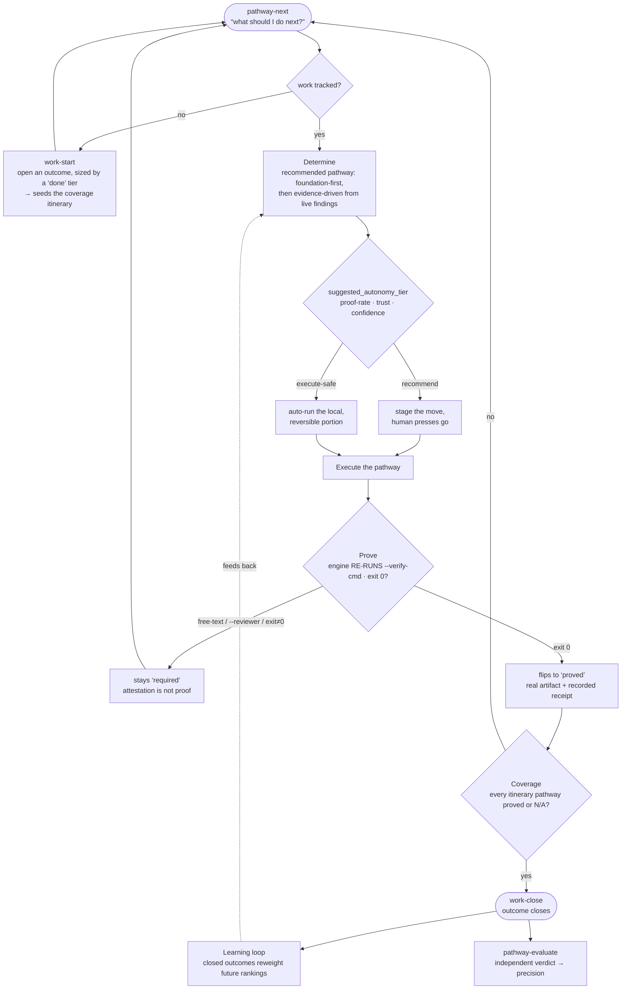

# pathway-operating-layer

A single-file Python CLI that recommends the next-best engineering **pathway** for a
project, tracks the work against one shared ID, and refuses to call an outcome done
until every pathway it needs is proved — with proof the engine actually re-runs, not a
claim you typed.

It is one script, standard library only (no pip install, no services). It reads a
project's review findings and its own history, ranks eleven engineering pathways
foundation-first, and hands back the one move to make next.

## What it is

Most "do the next thing" tools are dashboards: they show you a list and trust you to
act. This one closes the loop and enforces the parts that are easy to fake:

- **It recommends, foundation-first.** With nothing tracked, it tells you to pin the
  decision and the metric before building. As real findings pile up, a cluster of
  failures outranks the foundation gates — a pile of P0s overrides "do research first."
- **It tracks against one shared ID** (a "work envelope"). Every pathway you run logs
  against the same outcome, so coverage is a fact, not a memory.
- **It enforces a coverage guarantee.** When you open an outcome you pick a "done"
  tier; the tier seeds an *itinerary* — the set of pathways that MUST be covered. The
  outcome **cannot close** until every itinerary pathway is either proved-with-artifact
  or explicitly marked not-applicable with a reason. A pathway is never silently skipped.
- **It requires real proof.** A pathway flips to `proved` only when a verifier the
  engine **re-executes** exits 0 (the `--verify-cmd` flag). A free-text "I ran the
  tests" string, or a reviewer's name, is recorded for accountability but does not
  prove. (Why this matters: an adversarial audit flipped a pathway to `proved` with a
  junk file and the string `"lol yeah i totally ran the tests, trust me bro"`. The
  re-executed-verifier rule is the fix.)
- **It earns autonomy from a metric, not a setting.** Each turn the engine computes a
  `suggested_autonomy_tier` (`recommend` | `execute-safe`) from your proof track record,
  a trust check, and the pick's confidence. Autonomy can't be farmed by self-attestation
  because only verified proofs raise the rate.
- **It learns.** Closed outcomes reweight future rankings (a pathway a project has
  proved-and-closed is dampened so the recommender shifts toward what hasn't been
  demonstrated yet), and a `tier-calibrate` command measures, from closed-outcome
  history, where the default tier→pathway map diverges from what projects actually
  needed. Calibration is **advisory** — it never mutates the map (that would break the
  coverage guarantee); a human adopts changes deliberately.
- **It measures its own recommendation quality.** `pathway-evaluate` records an
  independent judge's verdict per recommendation and reports **precision** — so the
  tool's accuracy is a number you can falsify, not a claim it makes about itself.

## How the loop works



The spine is **coverage** (an outcome can’t close until every pathway is proved-with-artifact
or N/A-with-reason); the gate is **real proof** (a verifier the engine re-runs, not a claim);
the throttle is the **autonomy tier** (earned, never assumed); and the flywheel is the
**learning loop** plus independent **evaluation** that keeps the recommendations honest.

## The method it embodies

This is Andrej Karpathy's spec → verify → build, made operational:

- **Spec** — pin the *goal* (the decision the work drives) before the task; the smallest
  scope that ships one thing end-to-end; a falsifiable acceptance gate. The engine's
  "govern" pathway is exactly this: one decision, one measurable target, a cost/risk note,
  before any build.
- **Verify** — criteria up front, an independent second-model critic on the diff, and
  proof on the **real artifact** (a served page, a DB row, a measured delta) — not a unit
  return. The proof system encodes this: an executed verifier and a hashed artifact, not
  a free-text claim.
- **Build** — the smallest runnable slice that moves the metric, then measure it.

The ranking follows the **Karpathy ladder**: one thing end-to-end against a number, no
phase collapse, throwaway-v1 first, stop at the threshold. A generic primer on the method
lives in [`docs/karpathy-method.md`](docs/karpathy-method.md).

### Add the Karpathy skill

The method is also packaged as a drop-in **skill** ([`skills/karpathy/SKILL.md`](skills/karpathy/SKILL.md))
with three modes — `spec`, `verify`, `audit`. To install it in Claude Code (or any
agent that loads Markdown skills from a folder):

```bash
# Claude Code: skills live in ~/.claude/skills/
cp -r skills/karpathy ~/.claude/skills/karpathy
# then invoke it: /karpathy spec — <what you're starting>
```

It is self-contained and references no private tooling, so it works in any environment.

## Quickstart

Requires Python 3.9+. No dependencies.

```bash
# 1. What should I do next on this project? (read-only)
python3 scripts/operating-layer.py pathway-next --project /path/to/project --json

# 2. Open a tracked outcome — one shared work ID, sized by a "done" tier
python3 scripts/operating-layer.py work-start \
  --project /path/to/project --goal "Ship the export endpoint" --tier live
# → prints the work ID; every pathway logs against it

# 3. Prove a pathway with a re-executed verifier (this is what flips it to `proved`)
python3 scripts/operating-layer.py work-log \
  --work-id <WORK_ID> --pathway quality --kind verify \
  --gate quality-gate --evidence ./test-output.txt --result pass \
  --proof-type artifact --verify-cmd "pytest -q"
# The engine RE-RUNS `pytest -q`; the pathway proves only if it exits 0.

# 4. Close the outcome — refused until every itinerary pathway is proved or N/A
python3 scripts/operating-layer.py work-close --work-id <WORK_ID> --json

# Mark a pathway not-applicable (with a reason) so it stops blocking close
python3 scripts/operating-layer.py work-cover \
  --work-id <WORK_ID> --pathway security --na --reason "no untrusted input surface"

# 5. Measure the tool's own recommendation quality
python3 scripts/operating-layer.py pathway-evaluate \
  --project /path/to/project --pathway govern \
  --verdict correct --judge "second-model review" --note "tracked outcome, real gaps"
python3 scripts/operating-layer.py pathway-evaluate --summary   # → precision
```

The **work envelope** is the loop: `work-start` (open) → `work-log` (prove each
pathway) → `work-close` (only when coverage is complete). `work-cover`, `work-status`,
and `work-daily` round it out; `proof-add` / `proof-report` manage the proof registry.

## The eleven pathways

Ranked each turn; the itinerary for an outcome is a subset sized by its "done" tier.

| Pathway | The decision it answers |
|---|---|
| **research** | What must we know for certain before a plan can be trusted? |
| **govern** | What business outcome and falsifiable metric does this work move? |
| **data** | Is the entity model, lineage, and data boundary correct and safe to build on? |
| **security** | What can an untrusted actor reach, and is every secret/authz surface closed? |
| **release** | How does this ship safely, and how do we undo it if it's wrong? |
| **implementation** | What is the smallest slice that ships one thing end-to-end against the metric? |
| **quality** | What proves this is correct, and what gate stops regressions? |
| **observability** | Could we diagnose this at 3am from signals alone? |
| **techdebt** | What dependency or duplication will cost most if left? |
| **design** | Does the interface serve the workflow and the design system? |
| **docs** | What does the next operator need that isn't written down? |

`research` and `govern` are foundation gates: with nothing else signalling, they lead.
The "done" tiers seed the itinerary cumulatively:

- **demoable** — `govern, implementation, quality` (runs end-to-end, you can show it)
- **live** *(default)* — `+ data, observability, release, docs` (real users touch it)
- **production-secure** — `+ research, security, techdebt` (untrusted actors, compliance)

The goal's own words also pull in `design`, `research`, or `data` by keyword (e.g. a goal
mentioning "schema" or "migration" adds `data`).

## How proof works

Proof is the load-bearing idea, so the engine is strict about it:

1. **Evidence must be a real file that exists** — a test log, a migration, a served HTML
   capture, a report. The full file is SHA-256 hashed and the hash is recorded.
2. **A pathway proves only via a re-executed verifier.** Pass `--verify-cmd "<command>"`;
   the engine runs it (in the project directory, 120s timeout) and the pathway flips to
   `proved` **only if it exits 0** on a non-failing result. Each proof records its
   `verifier_strength` (`executed` / `signed` / `attested`), `exit_code`, the command, and
   the stdout hash.
3. **Claims don't prove.** A bare `--verified-by "<text>"` string is `attested`; a
   `--reviewer "<name>"` is `signed`. Both are kept for accountability, but neither flips a
   pathway to `proved` or raises the autonomy proof rate. Only `executed` proves.
4. **Fail-closed.** A verifier the engine can't run returns non-zero, so it cannot prove.

This is what makes `proved` mean *a verification actually passed*, and what stops autonomy
from being farmed by self-attestation.

## Status & limitations

This is honest about where it stands:

- **Single-operator store.** State lives in append-only NDJSON files in one local
  directory. There is no row-level locking or atomic write yet, so concurrent writers can
  lose updates and a killed process can truncate a ledger. Treat it as single-user.
- **The self-measurement sample is small.** `pathway-evaluate` exists and has been run
  blind on a handful of external projects with independent verdicts — enough to catch a
  real regression (an early run scored precision 0/3, the recommender was fixed, a re-judged
  re-run scored 3/3), but `n=3` is a start, not proof. Larger external samples are needed
  before the precision number means much.
- **Trivial verifiers still pass.** `--verify-cmd true` exits 0 and proves; the engine
  can't yet tell a real test from a no-op. The command is recorded for human audit.
- **Statistical thresholds are provisional.** The `0.50` autonomy gate and the minimum
  close counts for calibration have no confidence-interval basis yet.

The roadmap that tracks these — store robustness, confidence-interval gating, learning-loop
refinements, a module split, and a larger external-precision sample — is in
[`references/world-class-govern-ledger.md`](references/world-class-govern-ledger.md), which
records each gap with a falsifiable gate.

## Test

```bash
python3 scripts/tests/operating_layer_test.py
```

Standard library only. The suite includes an AST guard that fails on any duplicate
module-level constant/def name (a shadowing class a review caught that ordinary unit tests
missed), and regression tests that assert proof realness — a free-text claim leaves a
pathway `required`; a real exit-0 verifier flips it to `proved`.

## License

MIT — see [`LICENSE`](LICENSE).
